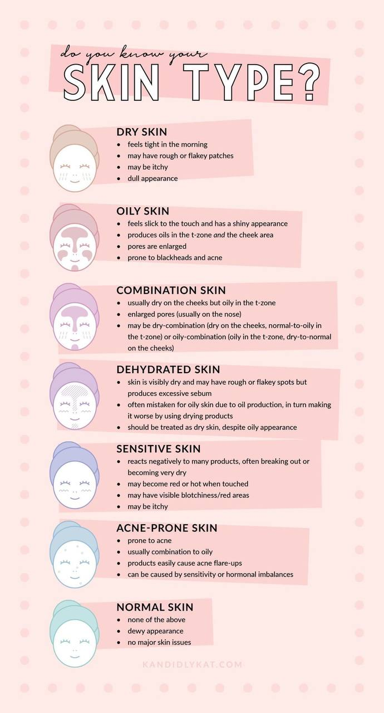

# Как выбрать свой тип кожи: руководство для начинающих

Выбрать правильный тип кожи - ключевой шаг к здоровому и эффективному уходу за ней. Кожа у всех разная, и важно понять ее особенности, чтобы подобрать подходящие средства и процедуры ухода. В мире косметологии выделяют несколько основных типов кожи: **нормальная, комбинированная, жирная, сухая, возрастная, чувствительная и склонная к акне**.

## **1.Нормальная кожа**
**Особенности**: Этот тип кожи сбалансирован и здоров. Она увлажнена, без видимых проблем или избыточного жирного блеска.

## **2. Комбинированная кожа**
**Особенности**: Характеризуется смешанными свойствами: обычно T-зона (лоб, нос, подбородок) жирная, а остальные участки сухие или нормальные.

## **3. Жирная кожа**
**Особенности**: Имеет избыток жира, часто блестит и подвержена появлению угрей и чёрных точек из-за повышенной выработки себума - естественного масла кожи.

## **4. Сухая кожа**
**Особенности**: Чувствительна к потере влаги, может быть шероховатой, стянутой и склонной к шелушению.

 
## **5. Возрастная кожа**
**Особенности**: С возрастом кожа теряет упругость и эластичность из-за снижения коллагена и эластина.

## **6. Чувствительная кожа**
**Особенности**: Реагирует на раздражители, может быстро покраснеть или появиться раздражение от определенных ингредиентов или погодных условий.

## **7. Кожа, склонная к акне**
**Особенности**: Склонна к образованию прыщей, угрей и воспалений из-за избытка себума, засорения пор или бактериальной активности.

Выбрать тип своей кожи можно, обратив внимание на ее реакцию на утреннее пробуждение, выявляя уровень жирности, степень увлажненности и наличие раздражений. Кроме того, профессиональные косметологи могут помочь определить тип кожи более точно.

Помните, что забота о коже должна быть индивидуальной и адаптированной под ваш тип. Наблюдение за реакцией кожи на различные продукты поможет подобрать оптимальный уход и сохранить ее здоровье и красоту на долгие годы.

